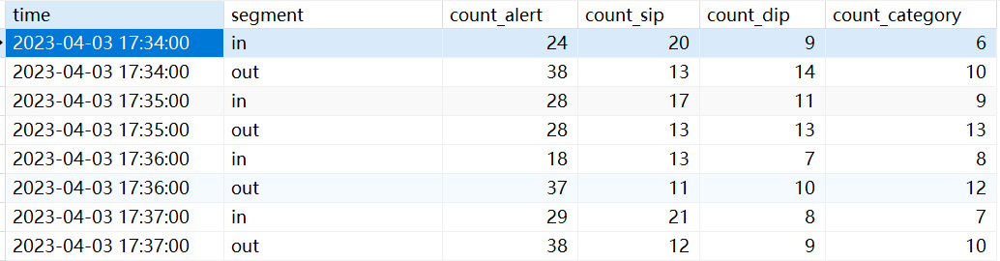

# 0.代码功能解释
每分钟分别统计一次内外网的告警数量、源IP数量、目的IP数量和告警类型数量
# 1.代码环境
```
certifi==2021.5.30
numpy==1.19.5
pandas==1.1.5
PyMySQL==1.0.2
python-dateutil==2.8.2
pytz==2022.4
schedule==1.1.0
six==1.16.0
wincertstore==0.2
```
# 2.代码运行说明
- 代码运行：`nohup python main.py > main.log 2>&1 &`
- 输入数据说明：
告警数据，保存于包含以下字段的数据库表中。

|属性名称	|属性类型	|属性描述|
| ---- | ---- | ----|
id	|int	|自增id
receivetime|	text|	告警时间
sip	|text|	源IP
sport|	text|	源端口
dip	|text	|目的IP
dport|	text|	目的端口
category|	text|	告警类型
description	|text|	告警描述
device_manufacturers|	text| 	告警设备厂商
in_or_out	|text|	内外网
attack_state|	text|	攻击状态
original_table_name|	text|	原始表名
block|	bigint|	是否阻断
threatLevel|	text|	威胁等级
handle_have|	bigint|	是否处理

- 输出数据说明
统计数据，保存于包含以下字段的数据库表中。

|字段名称|字段类型|字段描述|
| ---- | ---- | ---- |
time|datetime|时间
segment|text|内外网
count_alert|bigint|告警数
count_sip|bigint|源IP数
count_dip|bigint|目的IP数
count_category|bigint|告警类型数

示例：


# 4.代码所支撑的前端页面图

